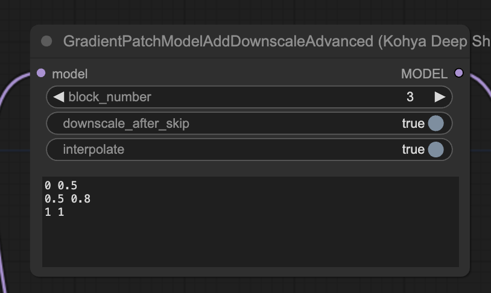

These nodes are variants of the default PatchModelAddDownscale which makes it possible to let the downscale factor scale linearly between points.
## 1. GradientPatchModelAddDownscale

**GradientPatchModelAddDownscale**  modifies a given model by adding a downscaling operation to a specific block of the model. This operation is applied during the forward pass of the model.

The downscaling operation is controlled by several parameters:

- block_number: The block in the model where the downscaling operation is applied.
- downscale_factor: The factor by which the input is downscaled.
- start_percent and end_percent: These parameters define a range in which the downscaling factor is linearly interpolated from 1/downscale_factor to 1.
- downscale_after_skip: A boolean flag that determines whether the downscaling operation is applied after the skip connection in the block.

The node returns a new model with the downscaling operation added.

## 2. GradientPatchModelAddDownscaleAdvanced

The GradientPatchModelAddDownscaleAdvanced node is a more advanced version of the GradientPatchModelAddDownscale node. It also modifies a given model by adding a downscaling operation to a specific block of the model.

In addition to the parameters of the GradientPatchModelAddDownscale node, the GradientPatchModelAddDownscaleAdvanced node also takes a config parameter. This parameter is a string that defines a set of percentage-scale factor pairs. The scale factor for a given percentage is determined by linearly interpolating between the defined pairs.

The interpolate parameter is a boolean flag that determines whether the scale factor is interpolated between the defined pairs or whether the scale factor of the nearest lower percentage is used.

The node returns a new model with the downscaling operation added.
